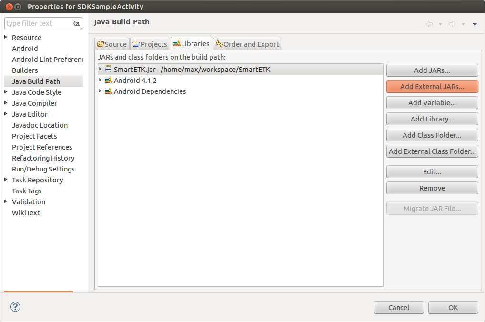
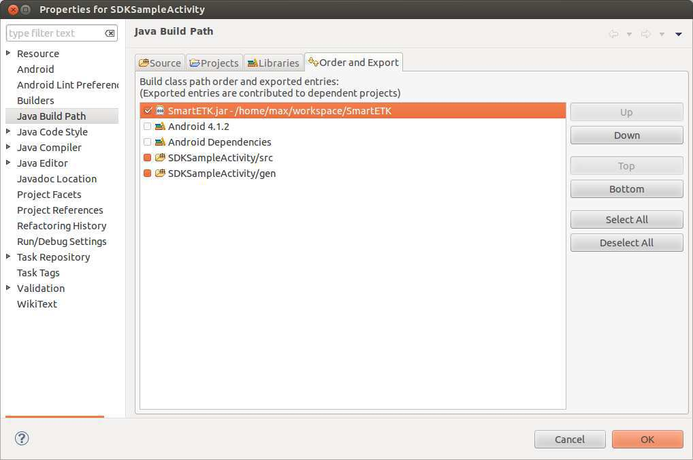

Smart ETK API General Notes
===========================

.. java:package:: com.viaembedded.smartetk

VIA Smart ETK SDK supports the hardware controlling API for GPIO, Watch
Dog, and UART (RS-232) modules.

Smart ETK is programmed with the socket IO as the communication between
JAVA and C language to control the hardware modules. We implemented the
board support service such as ``bss_vab820`` to meet the request from Smart ETK
API.

Compatibility
-------------

=============== ====  ==== ==== ==== ==== ==== ==== ==== ==== ==== ==== ====
Model           GPIO  WDT  RTC  WOL  RES  UART SUS  CEC  I2C  CAN  UPC  DPMS
=============== ====  ==== ==== ==== ==== ==== ==== ==== ==== ==== ==== ====
`VAB-820`_      ✓     ✓    ×    ×    ×    ✓    ×    ×    ×    ✓    ×    ×
`VAB-1000`_     ✓     ✓    ✓    ✓    ✓    ✓    ✓    ×    ✓    ✓    ×    ×
`ALTA DS 2`_    ×     ✓    ✓    ✓    ✓    ×    ✓    ×    ×    ×    ×    ×
`AMOS-820`_     ✓     ✓    ×    ×    ×    ✓    ×    ×    ×    ✓    ×    ×
`ARTiGO A900`_  ✓     ✓    ✓    ✓    ✓    ×    ✓    ×    ×    ×    ×    ×
`Viega`_        ×     ✓    ×    ×    ×    ×    ×    ×    ×    ×    ✓    ×
=============== ====  ==== ==== ==== ==== ==== ==== ==== ==== ==== ==== ====

**Legend**: ``GPIO``: :ref:`GPIO <gpio>` support, ``WDT``: :ref:`WatchDog <watchdog>` timer,
``RTC`` is Real-Time Clock Wake-up, ``WOL``: Wake-on-LAN, ``RES``: Restart,
``UART``: :ref:`UART <uart>` support, ``SUS``: Suspend, ``CEC``: HDMI CEC support,
``CAN``: :ref:`CAN <can>` support, ``UPC``: x, ``DPMS``: x.

.. _VAB-820: http://www.viatech.com/en/boards/pico-itx/vab-820/
.. _VAB-1000: http://www.viatech.com/en/boards/pico-itx/vab-1000/
.. _ALTA DS 2: http://www.viatech.com/en/systems/android-signage-players/alta-ds-2/
.. _AMOS-820: http://www.viatech.com/en/systems/industrial-fanless-pcs/amos-820/
.. _ARTiGO A900: http://www.viatech.com/en/systems/small-form-factor-pcs/artigo-a900/
.. _Viega: http://www.viatech.com/en/systems/ruggedized-tablets/viega/

Installation
------------

Open Eclipse IDE and create an Android project. In project properties, import
SmartETK.jar by pressing the button "Add External JARs...".

Select "Order and Export" tab, move ``SmartETK.jar`` to the top and choose it.

Permissions
-----------
Smart ETK is programmed with the socket IO as the communication between
JAVA and C language to control the hardware modules, therefore you need to
make sure that you have android.permission.INTERNET in AndroidManifest.xml:

.. code-block:: xml

   <uses-permission android:name="android.permission.INTERNET"/>
